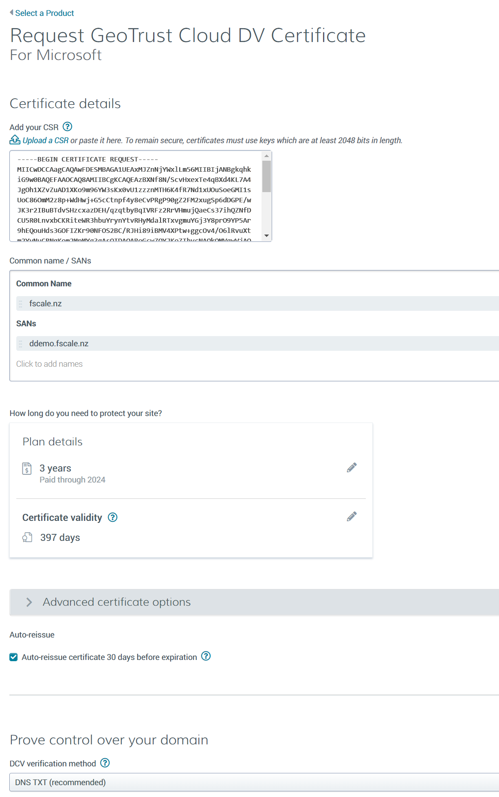
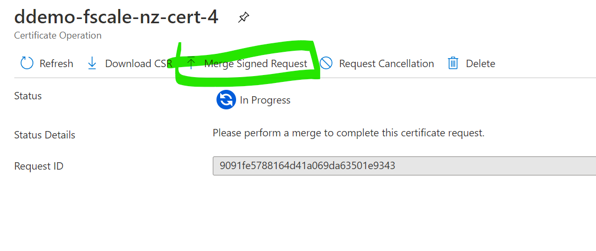

# DDoS reverse internet proxy

## TODO

* Restrict App GW to Front Door
* APIM
* VPN GW

## Installation

You will need

* WSL2 (Ubuntu-20.04)
* Latest AZ CLI installed in WSL2 environment

### Before you begin

* Register a domain name and set the `dnsZoneName` parameter in `deploy.sh`
* Reset the other parameters in `deploy.sh` as required
* Reset parameters in `deploy-front-door.sh` as required

### Run deploy scripts

```
./deploy-front-door.sh
./deploy.sh
```

### Configure nameservers

`deploy.sh` script will output Name Servers. Configure these with the domain registrar.

### Create a certificate request

`deploy.sh` script will output a CSR (certificate signing request). Copy into Certificate Authority's Certificate request form (Digicert is used in this example).



* Complete domain control validation (`TXT` record is easiest) and request the certificate
* When certificate has been issued, download the `.CER` file ready to merge

### Merge signed request

 Upload the `.CER` file to the Key Vault (that has been created in the Resource Group) to merge the signed request.



### Finish deployment

Re-run `./deploy.sh` to deploy the remainder of the solution.

## References

<https://techblog.hobor.hu/2018/08/26/self-signed-certificate-with-sans-using-azure-cli-keyvault/>

<https://github.com/Azure/azure-quickstart-templates/blob/68a14a9608c9b26ad61b281957aca066eaab179e/quickstarts/microsoft.network/front-door-custom-domain/main.bicep#L124-L136>

<https://www.rahulpnath.com/blog/azure-key-vault-digital-signatures-and-offline-verification/>
